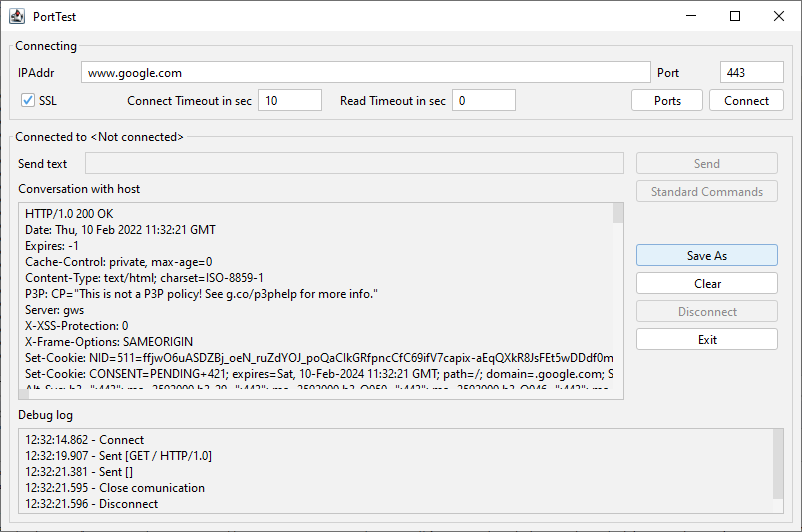
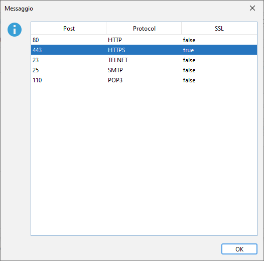
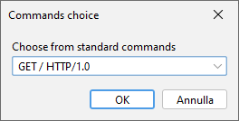

# PortTest

PortTest allow to test TCP Communication on a Socket Port with Plain Text or SSL Connections.

Are you trying to troubleshoot a connection issue on a socket port? One way to test the communication between the client and server is to use PortTest that that allows you to establish a TCP connection and send messages between the two.

## Documentation

PortTest check if a TCP/IP port is open.

You can use a plain test connection or a SSL connection.

PortTest have a predefinited port list, described in this [yaml file](https://github.com/matteobaccan/PortTest/blob/main/src/main/resources/port.yaml)

## Port.yaml
<pre>
  <code>
name: "Port definitions"
releaseDate: 2022-02-17
portDetails:
   - port: 80
     protocol: "HTTP"
     ssl: false
     commands:
         - cmd: "GET / HTTP/1.0"
         - cmd: "HEAD / HTTP/1.0"
         - cmd: "DELETE / HTTP/1.0"
   - port: 443
     protocol: "HTTPS"
     ssl: true
     commands:
         - cmd: "GET / HTTP/1.0"
         - cmd: "HEAD / HTTP/1.0"
   - port: 23
     protocol: "TELNET"
   - port: 25
     protocol: "SMTP"
   - port: 110
     protocol: "POP3"
  </code>
</pre>

Commands may be choosed by GUI

