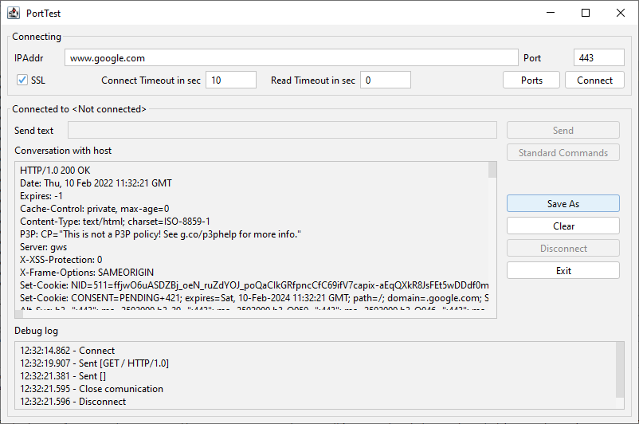
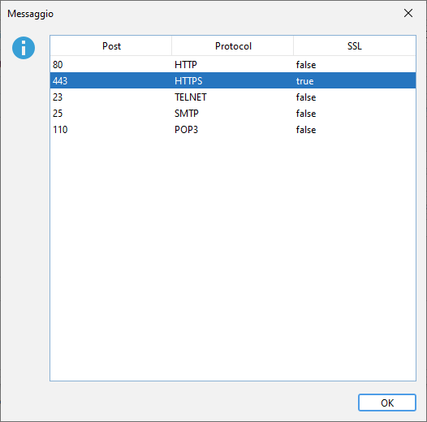
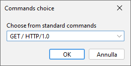

# PortTest: TCP & SSL Port Tester

PortTest is a user-friendly Java application designed to help you test TCP
communication on socket ports. Whether you need to troubleshoot a connection
issue, verify server availability, or inspect data exchange, PortTest provides
a simple interface for sending messages over plain text or SSL-encrypted
connections.

[](https://github.com/matteobaccan/PortTest/actions/workflows/codeql-analysis.yml)
[](https://github.com/matteobaccan/PortTest/actions/workflows/graalvm.yml)

## Features

- **Test TCP Connections:** Easily check if a TCP/IP port is open and
  responsive.
- **SSL Support:** Test connections over secure SSL/TLS channels.
- **Plain Text Communication:** Send and receive messages in plain text for
  non-encrypted protocols.
- **Predefined Port List:** Comes with a list of common ports and protocols
  (e.g., HTTP, HTTPS, SMTP) defined in `port.yaml`.
- **Standard Commands:** Send predefined commands for the selected port, or
  type your own.
- **Configurable Timeouts:** Set connect and read timeouts for each
  connection.
- **Save Conversation:** Save the data received from the server to a file.
- **User-Friendly GUI:** An intuitive graphical interface for easy operation.
- **Cross-Platform:** Being a Java application, PortTest can run on any system
  with Java installed.

## Getting Started

### Prerequisites

- Java Runtime Environment (JRE) 11 or higher.

### Installation

1. **Download:** Download the latest `PortTest-<version>.jar` from the
   [GitHub Releases page](https://github.com/matteobaccan/PortTest/releases).
   Windows users can also download `PortTest-<version>.exe`, a launcher that
   uses the Java installation pointed to by `JAVA_HOME`.
2. **Run:** Open your terminal or command prompt, navigate to the directory
   where you downloaded the JAR file, and run:

   ```bash
   java -jar PortTest-<version>.jar
   ```

   This will launch the PortTest GUI.

### Building from Source

The project includes the Maven Wrapper, so you don't need Maven installed,
only a JDK 11 or higher:

```bash
./mvnw package        # Linux / macOS
mvnw.cmd package      # Windows
```

The runnable JAR (with all dependencies) is created in
`target/PortTest-<version>.jar`, together with the Windows launcher
`target/PortTest-<version>.exe`.

To build a native executable with GraalVM, enable the `graalvm` profile:

```bash
./mvnw package -Pgraalvm
```

## Usage



1. **Enter Host and Port:**
   - In the "IPAddr" field, enter the hostname or IP address of the server
     you want to connect to.
   - In the "Port" field, enter the port number.
   - Alternatively, click "Ports" to choose a service from the predefined
     list. Selecting a row fills in the port number and the SSL setting.

   

2. **Choose Connection Options:**
   - Select the "SSL" checkbox if the server requires a secure connection
     (e.g., for HTTPS, SMTPS). Leave it unchecked for plain text connections.
   - Optionally adjust "Connect Timeout in Sec" (default `10`) and
     "Read Timeout in Sec" (default `0`, no timeout).

3. **Connect:**
   - Click the "Connect" button to establish a connection to the server.

4. **Send Commands:**
   - Once connected, type a command in the "Send text" field and click
     "Send". A CR/LF line ending is added automatically.
   - Click "Standard Commands" to choose one of the predefined commands for
     the current port. The chosen command is copied into the "Send text"
     field.

   

5. **View Communication:**
   - Data received from the server is shown in "Conversation with host".
   - Connection events, sent commands and errors are shown with timestamps in
     "Debug log".
   - Click "Save As" to save the conversation to a file, or "Clear" to empty
     it.

6. **Disconnect:**
   - Click the "Disconnect" button to close the connection, or "Exit" to quit
     the application.

## Configuration (`port.yaml`)

PortTest uses a `port.yaml` file to store a predefined list of services, ports,
and commands. This file is located in `src/main/resources/port.yaml` within the
source code, and is bundled with the application.

Here's an overview of the `port.yaml` structure:

```yaml
name: "Port definitions"
releaseDate: 2022-02-17 # Last update date of this configuration file
portDetails:
  - port: 80 # The port number
    protocol: "HTTP" # The common protocol name for this port
    ssl: false # Whether SSL is typically used for this protocol on this port
    commands: # A list of common commands for this protocol
      - cmd: "GET / HTTP/1.0"
      - cmd: "HEAD / HTTP/1.0"
      - cmd: "DELETE / HTTP/1.0"
  - port: 443
    protocol: "HTTPS"
    ssl: true
    commands:
      - cmd: "GET / HTTP/1.0"
      - cmd: "HEAD / HTTP/1.0"
  - port: 23
    protocol: "TELNET"
    # ssl is implicitly false if not specified
    # commands is implicitly empty if not specified
  - port: 25
    protocol: "SMTP"
  - port: 110
    protocol: "POP3"
  # ... and so on for other predefined ports
```

**Fields:**

- `name`: A descriptive name for the configuration.
- `releaseDate`: The date when this configuration was last updated.
- `portDetails`: A list of port definition objects.
  - `port`: The default TCP port number for the service.
  - `protocol`: A human-readable name for the protocol (e.g., "HTTP", "FTP").
  - `ssl`: (Optional) A boolean (`true` or `false`) indicating if SSL is
    typically enabled for this service on this port. Defaults to `false` if
    omitted.
  - `commands`: (Optional) A list of common commands that can be sent to the
    server for this protocol.
    - `cmd`: The actual command string.

Because the file is bundled inside the JAR, to customize the predefined list
you need to edit it and [build PortTest from source](#building-from-source).

## Contributing

Contributions are welcome! If you have suggestions for improvements, bug fixes,
or new features, please feel free to:

1. **Open an Issue:** Discuss the change you wish to make via the
   [GitHub Issues page](https://github.com/matteobaccan/PortTest/issues).
2. **Fork the Repository:** Create your own fork of the project.
3. **Create a Branch:** Make your changes in a dedicated branch.
4. **Commit Your Changes:** Follow good commit message practices.
5. **Open a Pull Request:** Submit a pull request for review.

Please ensure your code adheres to the existing style and that any new features
are appropriately documented.

## License

PortTest is open-source software licensed under the [MIT License](LICENSE).
See the `LICENSE` file for more details.
